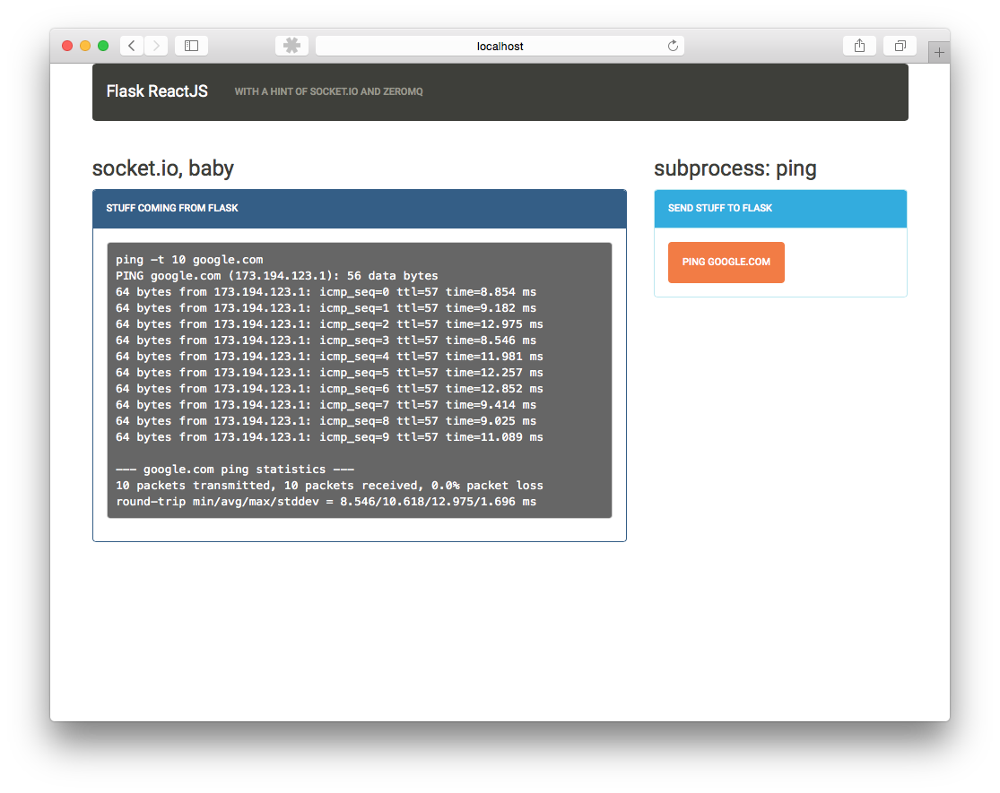

# Flask + ZeroMQ + ReactJS + Webpack + Bootstrap + Socket.IO

**Buzzwords...**



But this is the truth: By cloning this repo and following the
instructions you might get a working flask app that can ping arbitrary
domains when the client asks for it.

The client is a [webpack-powered](https://webpack.github.io/),
[ReactJS](https://facebook.github.io/react/) app styled by
[bootstrap](http://getbootstrap.com).


## Get it running in less than 300 seconds


#### step 1/5: install python dependencies

please be tidy, do this in a [virtualenv](https://virtualenv.pypa.io/en/latest/)

```bash
mkvirtualenv flask-react
pip install -r requirements.txt
```


#### step 2/5: install npm dependencies

and enure that the executables are visible in the `PATH`

```bash
npm install
export PATH=`pwd`/node_modules/bin:$PATH
```

#### step 3/5: compile assets with webpack

webpack will turn the

```bash
make static
```

#### step 4/5: run the app

this will also serve the static files

```bash
make run
```

#### step 5/5: run the zmq workers

```bash
make workers
```


# Open source projects used

* [flask-socketio](https://flask-socketio.readthedocs.org/en/latest/)
* [ReactJS](https://facebook.github.io/react/)
* [webpack](https://webpack.github.io/)
* [bootswatch](https://bootswatch.com/)
* [react-bootstrap](https://react-bootstrap.github.io/)
* [react-router](https://github.com/rackt/react-router)
* [react-dom](https://www.npmjs.com/package/react-dom)
* [gevent](http://www.gevent.org/)
